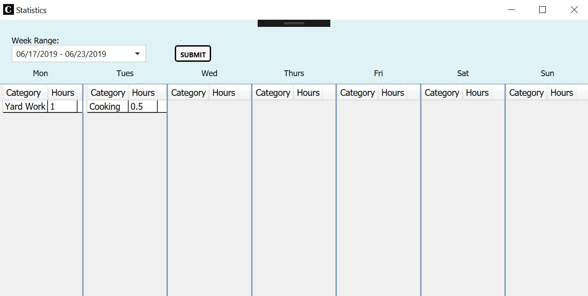

# Clairvoyance
Windows desktop application to track time spent on tasks.

### Views

There are two views used in this application, WeeklyAgenda and Statistics.

##### WeeklyAgenda

This is the main view that opens when the application is run. At the top, the current week range
is displayed. Tasks can be added by entering the Name, Day, Category, and Time fields and clicking
Submit. Categories and their respective totals in the week are shown in a DataGrid on the bottom 
right, and a new Category can be added with the "Add Category" button. The "Detailed Breakdown"
button launches the Statistics view.

##### Statistics

The Statistics view shows daily hour totals based on category. The week range can be selected with
the ComboBox and loaded with the "Submit" button.

### Models

This application uses six different Models classes.

##### TaskItem 
The TaskItem contains fields to store task information. Foreign keys are used to map the TaskItem
to the Category of the task, Day of the week that the class was completed, and the Week range information
which the task was completed.

##### Category
The Category is used to group tasks based on the ultimate project or bucket they are involved with.

##### CategoryTotals
CategoryTotals keeps track of a Category string (generated from the aforementioned Category
class), as well as a TotalHours running total, to be coupled with the Category.

##### Day 
Day represents the day of the week.

##### DayPlanner
The DayPlanner contains a NameOfDay string, and a list of TaskItem, TaskList. 

##### Week
Week represents a week range. It contains a MondayDate, and SundayDate DateTime values.

### ViewModels
##### WeeklyAgendaViewModel
This ViewModel is data bound to the main window. It uses the database layer to populate and alter 
the task and category lists. Tasks are shown based on the current week, and weekly totals per category
are displayed.

##### StatisticsViewModel
This ViewModel calculates and displays data for hourly totals for each category, by day. The information
changed can be shown based on the selected week.

### Database
The TaskDatabaseLayer interacts with the SQL Express database, and implements the ITaskContext interface. 
Dependencies are injected via constructor.

